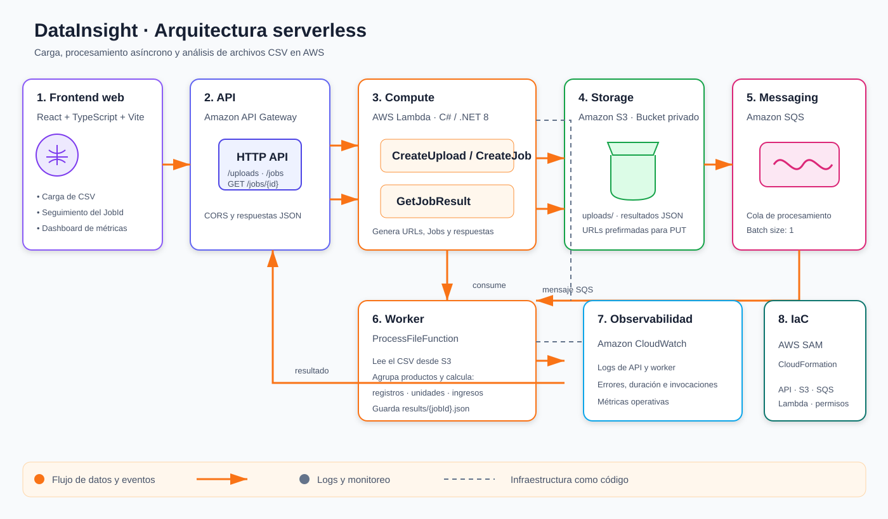

# DataInsight

Plataforma serverless para cargar archivos CSV de ventas, procesarlos de forma asíncrona y convertirlos en métricas accionables.

El proyecto combina un frontend en React con una API y un worker en C#/.NET 8 sobre AWS Lambda. La arquitectura está orientada a eventos: la API genera una URL prefirmada, el archivo se carga directamente a Amazon S3 y una cola Amazon SQS desacopla la carga del procesamiento.

## Qué hace

- Permite cargar archivos CSV desde una interfaz web.
- Genera URLs prefirmadas para subir archivos directamente a S3.
- Crea un trabajo de procesamiento y devuelve un `JobId`.
- Procesa los registros agrupándolos por producto.
- Calcula registros totales, unidades, ingresos y productos destacados.
- Permite consultar el estado y recuperar el resultado mediante polling.
- Presenta los resultados en un dashboard web.

## Arquitectura

```mermaid
flowchart LR
    U[Usuario] --> F[Frontend React + Vite]
    F -->|POST /uploads| API[Amazon API Gateway]
    F -->|PUT con URL prefirmada| S3[(Amazon S3)]
    F -->|POST /jobs| API
    API --> L1[Lambda API<br/>CreateUpload / CreateJob]
    L1 -->|Genera URL| S3
    L1 -->|Publica mensaje| Q[Amazon SQS]
    Q --> L2[Lambda Worker<br/>ProcessFileFunction]
    L2 -->|Lee CSV y guarda JSON| S3
    F -->|GET /jobs/{jobId}| API
    API --> L3[Lambda API<br/>GetJobResult]
    L3 -->|Lee results/{jobId}.json| S3
    L1 -.-> CW[CloudWatch Logs]
    L2 -.-> CW
    L3 -.-> CW
```

### Diagrama visual



### Flujo de una carga

1. El usuario selecciona un archivo CSV en el frontend.
2. El frontend solicita una URL prefirmada mediante `POST /uploads`.
3. El archivo se sube directamente a S3 con `PUT`.
4. El frontend crea el trabajo mediante `POST /jobs`.
5. La API genera un `JobId` y publica un mensaje en SQS.
6. `ProcessFileFunction` consume el mensaje, lee el CSV y calcula las métricas.
7. El resultado se guarda en S3 como `results/{jobId}.json`.
8. El frontend consulta `GET /jobs/{jobId}` hasta mostrar el resultado final.

## Servicios y responsabilidades

| Servicio | Responsabilidad |
| --- | --- |
| Amazon API Gateway | Expone los endpoints HTTP de la aplicación. |
| AWS Lambda | Ejecuta la API y el worker sin administrar servidores. |
| Amazon S3 | Almacena archivos cargados y resultados JSON. |
| Amazon SQS | Desacopla la recepción del archivo de su procesamiento. |
| Amazon CloudWatch | Centraliza los logs de las funciones Lambda. |
| AWS SAM / CloudFormation | Define y despliega la infraestructura como código. |

## Endpoints

La API usa como base la URL del stage `Prod`:

| Método | Ruta | Uso |
| --- | --- | --- |
| `POST` | `/uploads` | Solicita una URL prefirmada para un archivo. |
| `POST` | `/jobs` | Crea un trabajo de procesamiento. |
| `GET` | `/jobs/{jobId}` | Consulta el estado o recupera el resultado. |

Ejemplo de solicitud para obtener una URL de carga:

```json
{
  "fileName": "ventas.csv",
  "contentType": "text/csv"
}
```

Ejemplo de resultado:

```json
{
  "JobId": "6cb32de8-a7e8-471b-a521-b0e1e6ba5db2",
  "FileName": "ventas.csv",
  "Status": "Completed",
  "TotalRecords": 6,
  "TotalUnits": 32,
  "TotalRevenue": 13210,
  "TopSellingProduct": "Mouse",
  "HighestRevenueProduct": "Laptop"
}
```

## Estructura del repositorio

```text
DataInsight/
├── backend/
│   └── DataInsight/
│       ├── DataInsight.sln
│       ├── DataInsight/
│       │   ├── serverless.template
│       │   ├── src/DataInsight.Api/
│       │   │   ├── Functions/
│       │   │   ├── Application/
│       │   │   ├── Contracts/
│       │   │   └── Infrastructure/
│       │   └── tests/DataInsight.Api.Tests/
│       └── DataInsight.Worker/
│           ├── Functions/
│           ├── Application/
│           ├── Domain/
│           └── Infrastructure/
├── frontend/
│   ├── src/
│   │   ├── hooks/useJobPolling.ts
│   │   ├── services/dataInsightApi.ts
│   │   ├── types/dataInsight.ts
│   │   ├── App.tsx
│   │   └── index.css
│   ├── public/examples/data-insight-example.csv
│   ├── package.json
│   └── vite.config.ts
└── README.md
```

## Tecnologías

- **Frontend:** React, TypeScript, Vite, CSS y `lucide-react`.
- **Backend:** C# y .NET 8, AWS Lambda, AWS SDK for .NET.
- **AWS:** API Gateway, S3, SQS y CloudWatch.
- **Infraestructura:** AWS SAM y CloudFormation.

## Ejecución local

### Frontend

Requisitos: Node.js y npm.

```bash
cd frontend
npm install
```

Copia `.env.example` como `.env.local` y configura la URL de la API:

```env
VITE_API_BASE_URL=https://<api-id>.execute-api.<region>.amazonaws.com/Prod
```

Inicia el servidor de desarrollo:

```bash
npm run dev
```

Genera el build de producción:

```bash
npm run build
```

### Backend

Requisitos: .NET 8 SDK, AWS SAM CLI y credenciales AWS configuradas.

```bash
cd backend/DataInsight
dotnet restore DataInsight.sln
dotnet build DataInsight.sln
```

## Despliegue en AWS

La infraestructura está definida en `backend/DataInsight/DataInsight/serverless.template`.

```bash
cd backend/DataInsight/DataInsight
sam build --template-file serverless.template
sam deploy --guided
```

Después del despliegue, usa la URL del stage `Prod` en `frontend/.env.local` o en las variables de entorno del proveedor del frontend. Para Vercel, la configuración habitual es:

```text
Root Directory: frontend
Build Command: npm run build
Output Directory: dist
```

## Formato del CSV

El archivo debe incluir una fila de encabezados y tres columnas: `producto`, `cantidad` y `precio`.

```csv
producto,cantidad,precio
Laptop,2,3500
Mouse,10,80
Keyboard,5,150
Monitor,3,1200
```

El archivo de ejemplo está disponible en [`frontend/public/examples/data-insight-example.csv`](frontend/public/examples/data-insight-example.csv).

## Seguridad y operación

- No guardes credenciales AWS ni secretos en el repositorio.
- Mantén los archivos `.env.local` fuera del control de versiones.
- Usa permisos IAM mínimos para cada función.
- Mantén el bucket S3 privado y utiliza URLs prefirmadas para las cargas.
- Revisa CloudWatch Logs para diagnosticar errores de API y procesamiento.
- Considera añadir una Dead Letter Queue, alarmas de CloudWatch, autenticación con Cognito y CI/CD como siguientes mejoras.

## Estado del proyecto

La implementación actual procesa archivos CSV y almacena tanto los archivos de entrada como los resultados en S3. El procesamiento se ejecuta de forma asíncrona mediante SQS y Lambda.

## Autor

**Santiago**
